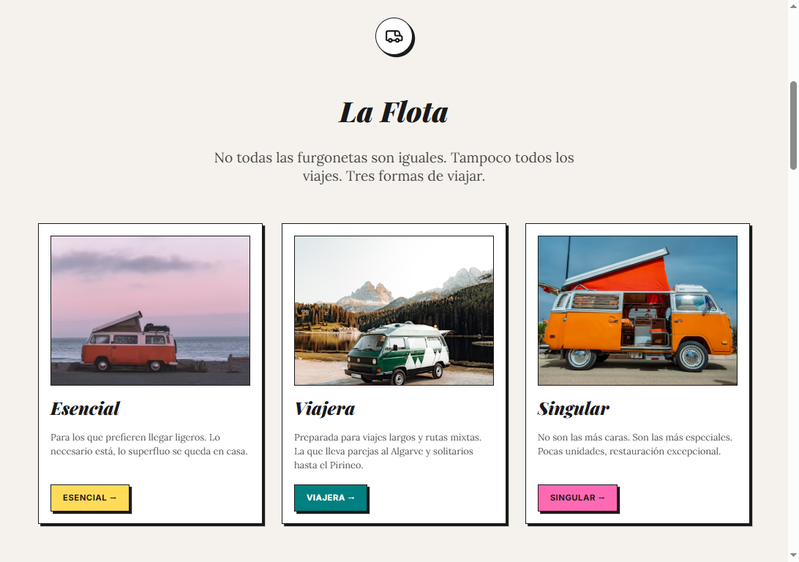
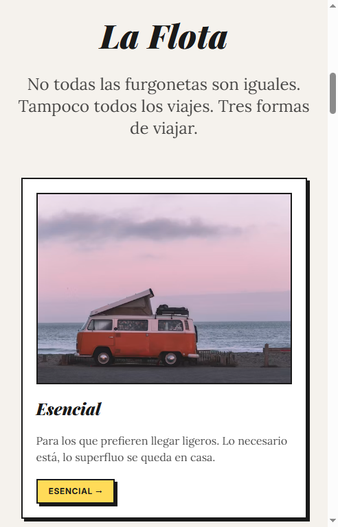
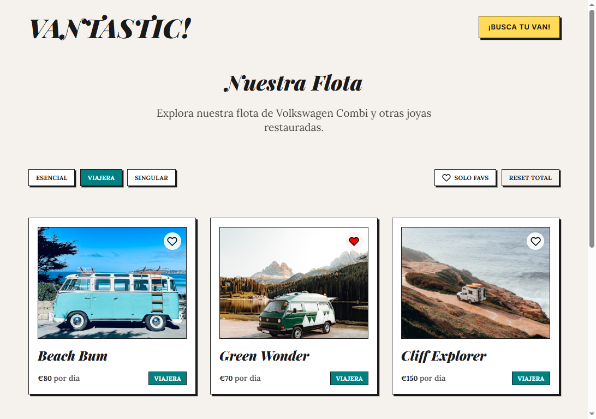
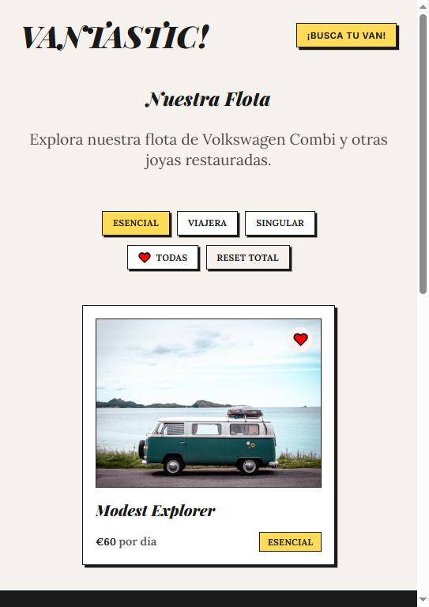
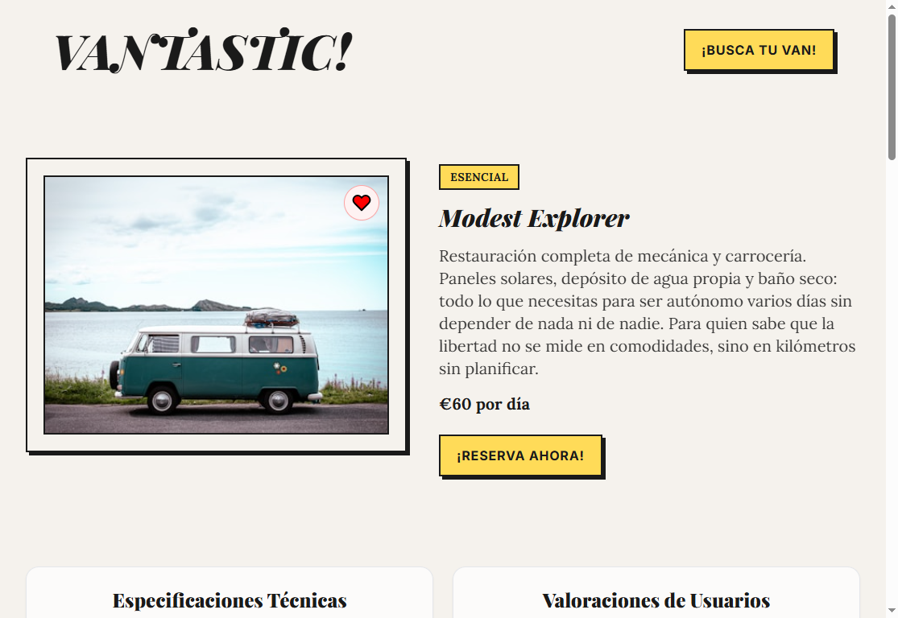
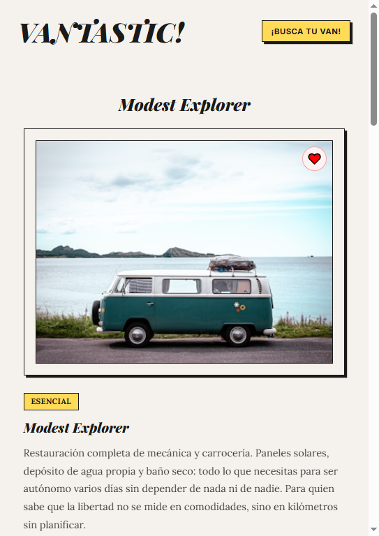

# Vantastic!

Vantastic! es una SPA hecha con React para explorar y reservar furgonetas camper de estilo vintage. La app permite ver la home, navegar por la flota, filtrar vans por tipo, guardar favoritas, entrar al detalle de cada van y completar un formulario de reserva.

El proyecto forma parte de una entrega de React del Master en FullStack Development. La prioridad es demostrar arquitectura frontend, rutas, estado, contexto, hooks, consumo de API mock, formulario validado y una interfaz responsive.

## Documentacion

- [Notas de desarrollo](./docs/dev-notes.md): mapa tecnico del proyecto, flujo de datos y decisiones importantes.
- [Justificacion de requisitos](./docs/justificacion-requisitos.md): relacion entre los requisitos de la entrega y su implementacion.

## Quick Start

Requisitos:

- Node.js 18 o superior.
- npm.

Instalacion:

```bash
npm install
```

Servidor local:

```bash
npm run dev
```

Despues abre la URL que indique Vite, normalmente `http://localhost:5173`.

Build de produccion:

```bash
npm run build
```

Preview del build:

```bash
npm run preview
```

## Stack

- React 19
- Vite 7
- React Router DOM 7
- React Hook Form
- MirageJS para simular la API
- Tailwind CSS 3 y CSS modular por secciones
- Lucide React para iconos

## Funcionalidades principales

- Home responsive con Hero, preview de flota, galeria, newsletter, About y testimonios.
- Catalogo de vans con filtros por tipo, filtro de favoritas y reset total.
- Tarjetas de van reutilizables con boton de favoritos.
- Detalle de van con imagen, descripcion, precio, etiqueta de tipo, especificaciones, valoraciones y formulario.
- Formulario de reserva con validacion, ciudades desde API mock y modal de confirmacion accesible.
- Estado global de favoritos con Context API.
- Navegacion por rutas y enlaces con hash a secciones de la home.
- Pagina 404 para rutas inexistentes.

## Screenshots

| Seccion | Widescreen | Mobile |
| --- | --- | --- |
| Home |  |  |
| Vans |  |  |
| VanDetail |  |  |

## Estructura

```text
src/
|-- api/          # MirageJS: datos y endpoints mock
|-- components/   # Layout, Header, Footer, VanCard, BookingForm, Heart
|-- context/      # FavoritesContext y hook useFavorites
|-- hooks/        # useFetch para peticiones
|-- pages/        # Home, Vans, VanDetail, NotFound
|-- pages/sections/
|   |-- Home*     # Secciones de la home
|   |-- VanSpecs  # Contenido de specs reutilizable
|   `-- VanRatings
|-- styles/       # CSS organizado por area de la app
|-- utils/        # Filtros y utilidades pequenas
|-- App.jsx       # Rutas
`-- main.jsx      # Entrada de React y providers globales
```

## Archivos clave

- `src/main.jsx`: monta React, activa `BrowserRouter`, arranca MirageJS y envuelve la app con favoritos.
- `src/App.jsx`: define rutas principales y rutas anidadas del detalle de van.
- `src/api/server.js`: crea la API mock con vans, specs, ratings y locations.
- `src/hooks/useFetch.jsx`: centraliza carga de datos, loading y errores.
- `src/context/FavoritesContext.jsx`: comparte favoritos entre catalogo, tarjetas y detalle.
- `src/pages/Vans.jsx`: lee filtros desde la URL y muestra el catalogo filtrado.
- `src/pages/VanDetail.jsx`: muestra detalle de van y conecta el CTA con el formulario.
- `src/components/BookingForm.jsx`: gestiona validacion, fechas dependientes y modal de exito.

## Estado actual

El proyecto compila correctamente con:

```bash
npm run build
```

El proyecto esta preparado para revision. Conviene volver a ejecutar `npm run build` y hacer una ultima comprobacion visual si se modifican estilos, rutas o contenido antes de publicar.
